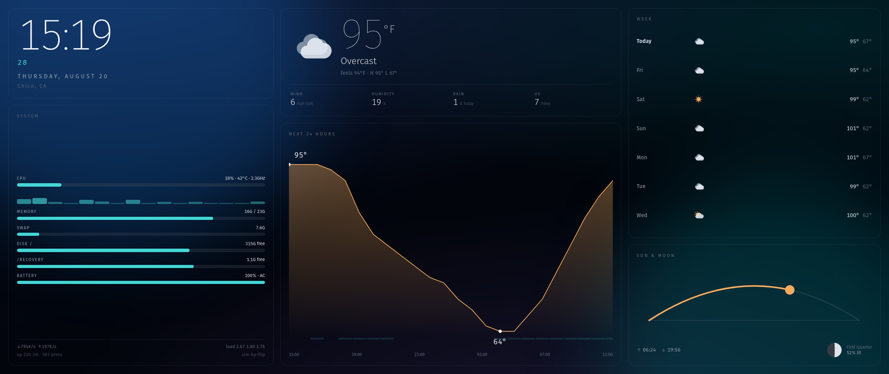

# Desktop Dashboard

A live HTML page rendered as the desktop background on COSMIC / Wayland —
weather, clock, forecast, sun & moon, and system stats. Not a wallpaper
image on a timer: a real WebKit view with CSS animation and JS, sitting
below your windows.



## How it works

| Piece | Role |
|---|---|
| `bin/dashd-serve` | Serves `web/` and `/api/state` on `127.0.0.1:4320` |
| `bin/dashd-host`  | One WebKit layer-shell surface per monitor, on the `BOTTOM` layer |
| `web/`            | The page — Tailwind v4 browser build, no build step |
| `data/`           | `weather.json` cache + `extra.json` for your own panels |

`BOTTOM` puts the surface above `cosmic-bg` (which still owns `BACKGROUND`)
and below every normal window. Clicks and scrolls pass straight through — the
surface takes an empty input region and never accepts keyboard focus.

## Run it

```bash
./install.sh                                    # links user units, enables nothing
systemctl --user start desktop-dashboard-serve desktop-dashboard-host
systemctl --user enable ...                     # optional: also start at login
```

Or run it in the foreground to watch the logs:

```bash
python3 bin/dashd-serve &
GDK_BACKEND=wayland python3 bin/dashd-host
```

## Editing the page

`web/` is plain HTML/CSS/JS with Tailwind compiled in the browser, so there
is nothing to rebuild:

```bash
$EDITOR web/index.html
systemctl --user reload desktop-dashboard-host   # SIGHUP → reload all views
```

Preview a layout without touching the desktop — `?static=1` disables the
entrance animation, which headless Chrome would otherwise capture mid-fade:

```bash
google-chrome --headless=new --window-size=2560,1080 --virtual-time-budget=9000 \
  --screenshot=out.png 'http://127.0.0.1:4320/index.html?static=1'
```

## Configuration

All of it lives in `config.json`.

- `location` — pinned to Chico, CA. Change via
  `https://geocoding-api.open-meteo.com/v1/search?name=<city>`.
- `units` — `fahrenheit`/`celsius`, `mph`/`kmh`, `clock24`.
- `display.transparent` — `true` lets your `cosmic-bg` photo wallpaper show
  through behind the panels, which keep their blur. `false` (default) gives
  the page its own gradient background.
- `display.layer` — `BOTTOM` is correct here. `BACKGROUND` will render but
  stay invisible beneath `cosmic-bg`; see `CLAUDE.md`.
- `outputs` — per-monitor overrides, keyed by the name from
  `bin/dashd-host --list`.

## Adding your own data

Anything written to `data/extra.json` is merged into `/api/state` under
`extra` and is readable from the page as `state.extra`. So a cron job or
another script can feed the dashboard without modifying the server:

```bash
echo '{"agenda":[{"at":"14:00","what":"Standup"}]}' > data/extra.json
```

## Troubleshooting

**Nothing on the desktop.** Check both processes are up and the surfaces
mapped:

```bash
pgrep -af 'dashd-serve|dashd-host'
curl -s localhost:4320/api/health
```

`dashd-host` logs one line per monitor at startup. If it lists your monitors
but you see nothing, `display.layer` is probably back on `BACKGROUND`.

**Weather is stale.** `/api/state` reports `weather.stale` and
`weather.age_seconds`; the page shows the age next to the hi/lo when stale.
The cache is served through outages by design.

**Monitors changed.** The host rebuilds its surfaces on monitor add/remove.
